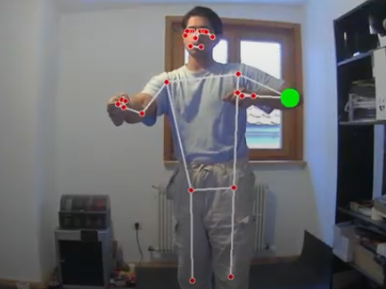
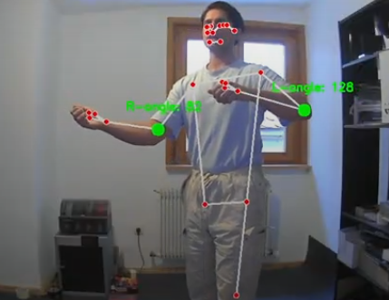

# Real-Time Pose Estimation and Feedback for Violinists

This project focuses on real-time body tracking for violinists using MediaPipe for pose estimation and provides feedback on their posture and movements. It includes multiple tasks related to motion tracking, posture evaluation, and using machine learning for motion classification.

## Tasks

### Real-Time Posture Feedback – Tracking Bowing Arm Movement
Filename: posture_feedback_webcam.py

**Overview**

Tracks the bowing arm's elevation and flags poor posture if the elbow is higher than the shoulder.

**Features**

* **Live Pose Detection**: Uses MediaPipe to detect human body landmarks in real-time.
* **Landmark Tracking**: Tracks left shoulder and left elbow positions from each frame.
* **Posture Evaluation**: Compares vertical positions of the elbow and shoulder to check if the elbow is raised above the shoulder.
* **Visual Feedback**: If the elbow is raised above the shoulder, a red circle is drawn; otherwise, a green circle is displayed.

#### Demo Video:
[Watch the demo video](https://drive.google.com/file/d/1-qsEet-vwrD8QSecjFgiGkP6VNFDg-CS/view?usp=drive_link)


**Running the Task**

1.  Run the Task:

    ```bash
    git clone https://github.com/Shuvam-M-Astro/Neptune-Submission-MediaPipe-Pose-Estimation.git
    cd Neptune-Submission-MediaPipe-Pose-Estimation
    pip install mediapipe opencv-python
    ```

### 3D Pose Estimation – Tracking Violin Posture Angles

Filename: violin_arm_angle_checker.py

**Overview**

Computes 3D joint angles and compares them against reference posture angles.

**Features**

* **3D Pose Detection**: Uses MediaPipe Pose to detect the 3D coordinates of key body landmarks (shoulders, elbows, wrists).
* **Angle Calculation**: Calculates joint angles for both right and left arms using vector math in 3D space.
* **Reference Comparison**: Compares live arm angles to predefined reference posture angles.
* **Visual Feedback**: Shows angle values in real-time and flags any deviations from the reference angles.

#### Demo Video:
[Watch the demo video](https://drive.google.com/file/d/1INlvHgj14Wu5y-Trw-PXVSD4Kqs8fJHA/view?usp=drive_link)



**Running the Task**

1.  Run the Task:

    ```bash
    git clone https://github.com/Shuvam-M-Astro/Neptune-Submission-MediaPipe-Pose-Estimation.git
    cd Neptune-Submission-MediaPipe-Pose-Estimation
    pip install mediapipe opencv-python numpy
    ```

### BlazePose-Based Motion Tracker – Shoulder Elevation Detection
Filename: shoulder_elevation_tracker.html

**Overview**

Web-based BlazePose tool with temporal smoothing to detect uneven shoulder elevation during bowing.

**Features**

* **BlazePose Pose Detection**: Uses TensorFlow.js to run the BlazePose model directly in the browser.
* **Temporal Smoothing**: Applies an exponential moving average (EMA) to smooth the vertical shoulder positions and reduce jitter.
* **Shoulder Elevation Detection**: Compares the smoothed shoulder positions to determine if one shoulder is elevated during bowing.
* **Console Feedback**: Logs the smoothed shoulder positions and their elevation status.

#### Demo Video:
[Watch the demo video](https://drive.google.com/file/d/1GMIfspa2m1lc5bdMmxDCNVFd10LDX8uj/view?usp=drive_link)

**Running the Task**

1.  Clone the repository and navigate to the web folder:

    ```bash
    git clone https://github.com/Shuvam-M-Astro/Neptune-Submission-MediaPipe-Pose-Estimation.git
    cd Neptune-Submission-MediaPipe-Pose-Estimation/web
    ```

2.  Install dependencies using npm:

    ```bash
    npm install tensorflow
    ```

3.  Open `index.html` in a browser, and check the console (press F12) to see the real-time shoulder elevation status.

### Violin Movement Classification – Steady vs. Shaky Bowing

Filename: violin_wrist_stability_classifier.py

**Overview**

Trains a Random Forest classifier on wrist movement data to detect steady vs. shaky bowing.

**Features**

* **Motion Feature Extraction**: Extracts wrist movement data (amplitude, velocity, acceleration) from MediaPipe Pose landmarks.
* **Shakiness Classification**: Classifies wrist movement as steady or shaky using a Random Forest classifier.
* **Visualization**: Annotates the video with "steady" or "shaky" labels for each 10-frame segment.

**Running the Task**

1.  Run the Task:

    ```bash
    git clone https://github.com/Shuvam-M-Astro/Neptune-Submission-MediaPipe-Pose-Estimation.git
    cd Neptune-Submission-MediaPipe-Pose-Estimation
    pip install mediapipe opencv-python scikit-learn
    ```

## Project Setup

1.  Clone the repository:

    ```bash
    git clone https://github.com/Shuvam-M-Astro/Neptune-Submission-MediaPipe-Pose-Estimation.git
    cd Neptune-Submission-MediaPipe-Pose-Estimation

    ```

2.  Install dependencies:
    Use the following to install all necessary Python dependencies for the project:

    ```bash
    pip install -r requirements.txt
    ```
3.  For the web-based task, navigate to the web directory and run the necessary commands:

    ```bash
    npm install tensorflow
    ```

3.  Run the script: Follow the instructions for each task to run the corresponding script.

## Contributing

Feel free to fork this repository and submit pull requests with improvements or new features. Please make sure to follow best practices for code quality and documentation.
